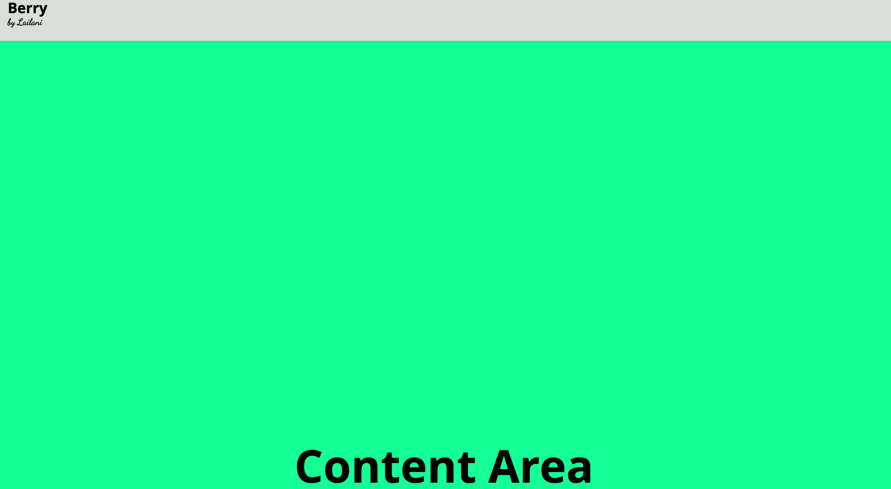
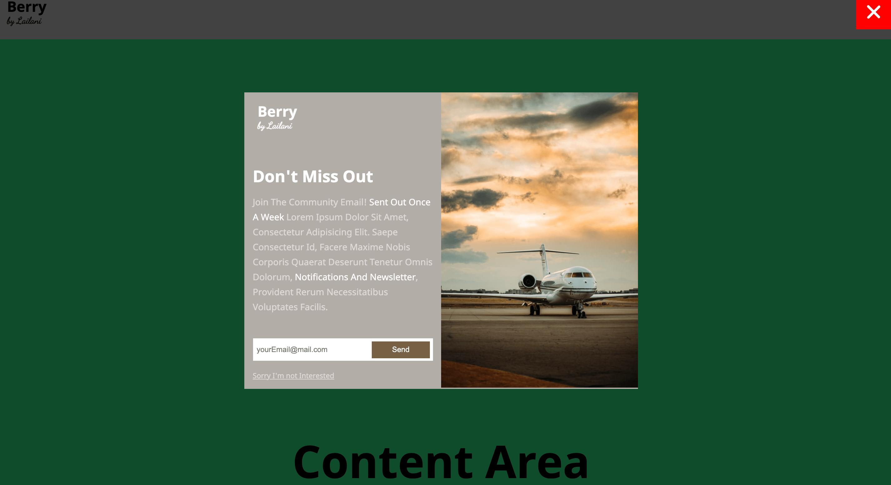
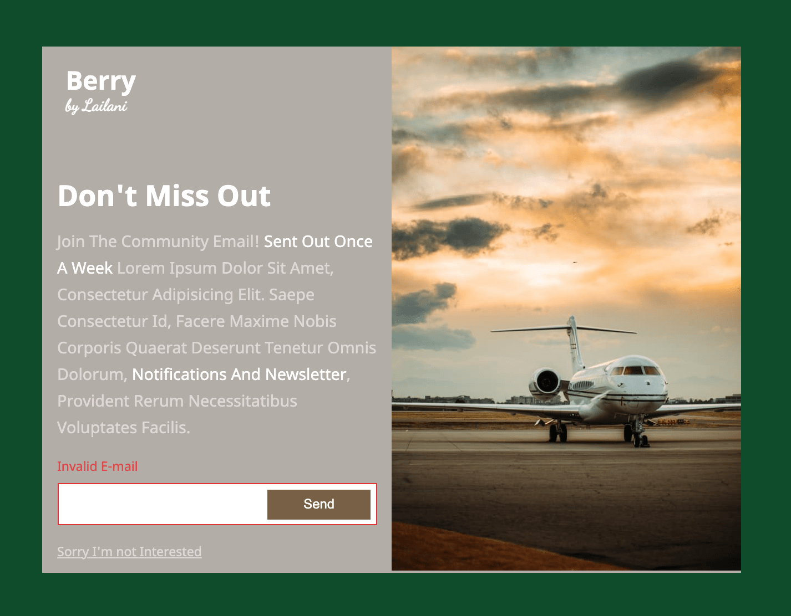
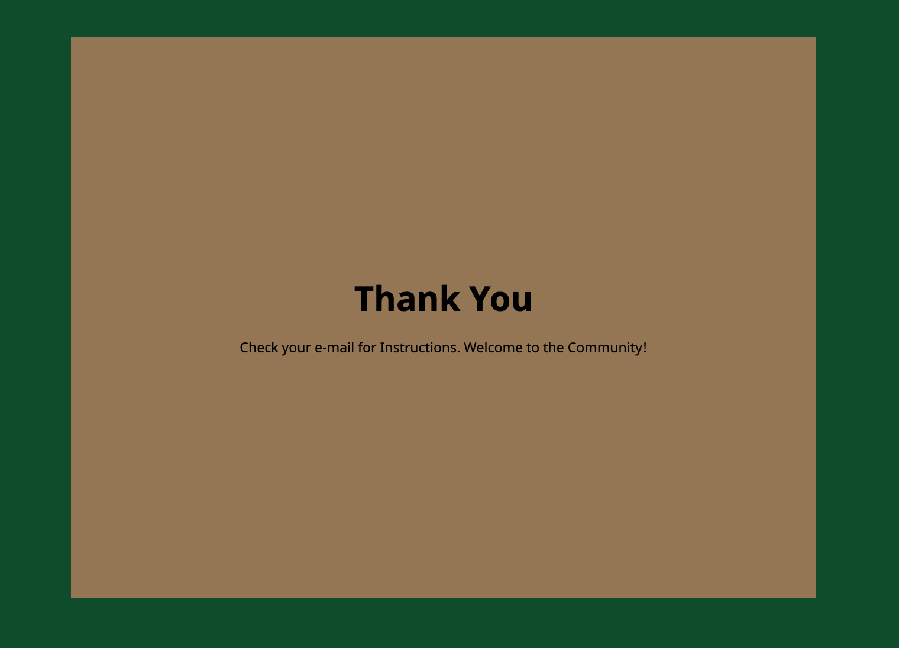

# Email-Capture_modal

## Overview

The e-mail capture modal activates when a user tries to leaves the main document screen. The modal consists of two simple columns where one provides a short description and an input field to capture the e-mail, the other provides an image related to your business. E-mail validation is incorporated, error messages will display on incorrect formating. On a successful e-mail capture, a "Thank-You" message display's to the user. **You can check out the modal here** :point_right:[Github Pages](https://halo8424.github.io/Email-Capture_modal/)

## Modal Images

## Personal Growth

- Naming classes and targeting them through CSS
- Adding flags to classes
- The window object
- Event listeners
- Meaningful variable names
